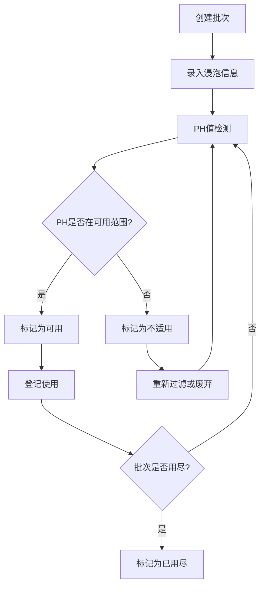

## 1. 产品概述
传统染坊草木灰水管理系统，用于记录和管理草木灰水的浸泡、过滤、碱度变化和可用批次。帮助染坊实现灰水批次的全生命周期管理，确保染色工艺的质量稳定性。

## 2. 核心功能

### 2.1 用户角色
| 角色 | 注册方式 | 核心权限 |
|------|----------|----------|
| 染坊管理员 | 系统内置 | 批次管理、数据录入、报表查看、系统配置 |
| 染坊工人 | 管理员创建 | 批次查询、使用登记、PH检测录入 |

### 2.2 功能模块
1. **批次管理**：灰水批次创建、编辑、状态跟踪
2. **原料管理**：草木灰原料来源记录
3. **浸泡记录**：浸泡时间、温度、加水比例管理
4. **过滤管理**：过滤次数、过滤日期记录
5. **PH检测**：PH值检测记录、碱度变化曲线
6. **使用记录**：批次使用登记、染色工序关联
7. **统计分析**：批次状态统计、碱度趋势分析

### 2.3 页面详情
| 页面名称 | 模块名称 | 功能描述 |
|---------|----------|----------|
| 批次列表页 | 批次概览 | 展示所有批次列表，支持按状态、日期筛选，显示批次编号、原料来源、当前PH值、状态 |
| 批次详情页 | 详细信息 | 显示批次完整信息，包含浸泡记录、过滤记录、PH检测历史、使用记录 |
| 碱度曲线页 | 趋势图表 | 以折线图展示PH值随时间变化曲线，标注可用范围和工序适配性 |
| 新建批次页 | 表单录入 | 创建新批次，录入原料信息、浸泡参数、初始检测数据 |
| 使用登记页 | 使用记录 | 登记批次使用情况，关联染色工序，更新批次状态 |

## 3. 核心流程

用户创建灰水批次 → 录入浸泡信息 → 定期检测PH值 → 执行过滤操作 → 查看碱度变化曲线 → 判断适用工序 → 登记使用记录 → 批次用尽标记

## 4. 用户界面设计

### 4.1 设计风格
- 主色调：土褐色 (#8B4513) 搭配草木绿 (#556B2F)，体现传统染坊的自然质朴风格
- 辅助色：靛蓝色 (#4B0082) 用于强调和交互元素
- 中性色：米白色背景 (#F5F5DC) 搭配深棕色文字
- 按钮风格：圆角矩形，带有轻微木纹纹理效果
- 字体：标题使用衬线字体 (Noto Serif SC)，正文使用无衬线字体 (Noto Sans SC)
- 布局：卡片式布局，带有仿古边框装饰
- 图标风格：线性图标，融入植物染元素

### 4.2 页面设计概述
| 页面名称 | 模块名称 | UI元素 |
|---------|----------|--------|
| 批次列表页 | 批次概览 | 顶部筛选栏、批次卡片网格、状态标签、快捷操作按钮 |
| 批次详情页 | 详细信息 | 左侧信息面板、右侧标签页切换（浸泡/过滤/PH/使用）、碱度曲线图 |
| 碱度曲线页 | 趋势图表 | 大尺寸折线图、PH范围标注区域、工序适配性说明 |
| 新建批次页 | 表单录入 | 分组表单、日期选择器、数字输入框、实时验证提示 |
| 使用登记页 | 使用记录 | 工序选择下拉框、用量输入、使用日期、确认弹窗 |

### 4.3 响应式
- 桌面端：侧边导航 + 主内容区，多列布局
- 平板端：顶部导航 + 网格自适应
- 移动端：底部导航 + 单列堆叠布局，触摸优化

### 4.4 交互细节
- 批次卡片悬停时轻微上浮并显示阴影
- PH值指示器根据数值变化颜色（酸性红色、中性绿色、碱性蓝色）
- 表单验证错误时震动提示
- 曲线数据点悬停显示详情弹窗
- 状态变更时平滑过渡动画
