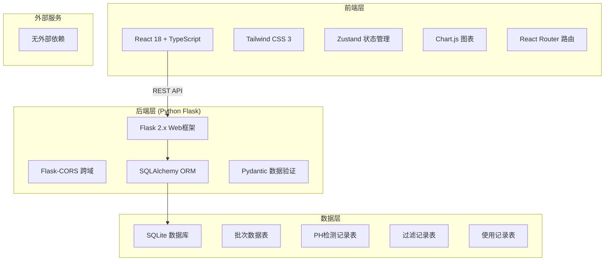
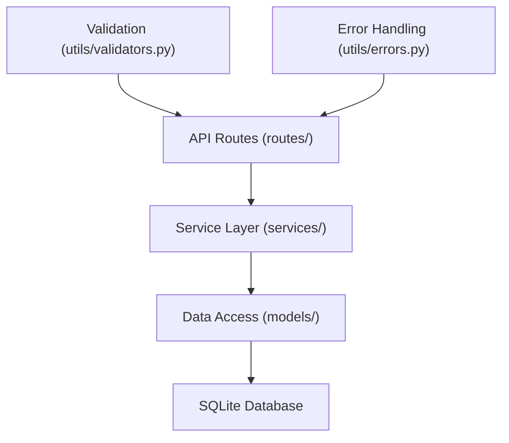
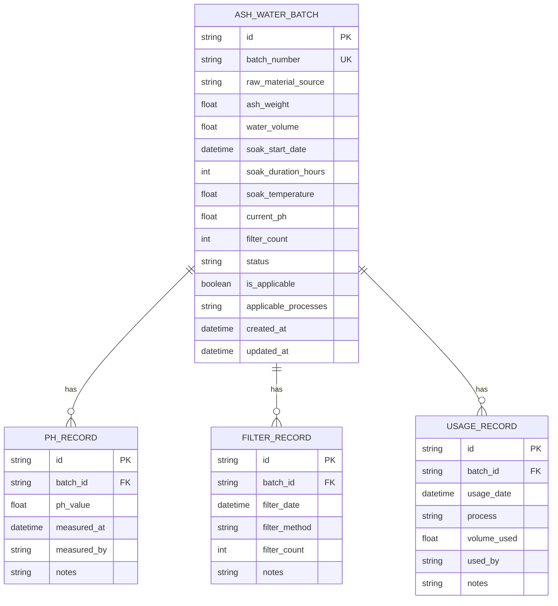

## 1. 架构设计



## 2. 技术描述

- 前端：React@18 + TypeScript + Vite + TailwindCSS@3 + Zustand + Chart.js
- 初始化工具：vite-init
- 后端：Python 3.10+ + Flask 2.x + SQLAlchemy + Pydantic
- 数据库：SQLite（轻量级，适合本地部署）
- API协议：RESTful JSON

## 3. 路由定义

| 路由 | 页面 | 用途 |
|------|------|------|
| / | 批次列表页 | 展示所有批次概览 |
| /batch/:id | 批次详情页 | 查看单个批次完整信息 |
| /batch/:id/curve | 碱度曲线页 | 查看PH值变化趋势 |
| /batch/new | 新建批次页 | 创建新的灰水批次 |
| /batch/:id/use | 使用登记页 | 登记批次使用记录 |

## 4. API 定义

### 4.1 类型定义
```typescript
// 批次状态
type BatchStatus = 'soaking' | 'filtering' | 'available' | 'not_applicable' | 'exhausted';

// 染色工序
type DyeingProcess = 'scouring' | 'mordanting' | 'dyeing' | 'fixing';

// 批次信息
interface AshWaterBatch {
  id: string;
  batchNumber: string;
  rawMaterialSource: string;
  ashWeight: number;
  waterVolume: number;
  soakStartDate: string;
  soakDurationHours: number;
  soakTemperature: number;
  currentPh: number;
  filterCount: number;
  status: BatchStatus;
  isApplicable: boolean;
  applicableProcesses: DyeingProcess[];
  createdAt: string;
  updatedAt: string;
}

// PH检测记录
interface PhRecord {
  id: string;
  batchId: string;
  phValue: number;
  measuredAt: string;
  measuredBy: string;
  notes: string;
}

// 过滤记录
interface FilterRecord {
  id: string;
  batchId: string;
  filterDate: string;
  filterMethod: string;
  filterCount: number;
  notes: string;
}

// 使用记录
interface UsageRecord {
  id: string;
  batchId: string;
  usageDate: string;
  process: DyeingProcess;
  volumeUsed: number;
  usedBy: string;
  notes: string;
}
```

### 4.2 接口列表
| 方法 | 路径 | 说明 |
|------|------|------|
| GET | /api/batches | 获取批次列表 |
| GET | /api/batches/:id | 获取批次详情 |
| POST | /api/batches | 创建新批次 |
| PUT | /api/batches/:id | 更新批次信息 |
| DELETE | /api/batches/:id | 删除批次 |
| GET | /api/batches/:id/ph-records | 获取PH检测记录 |
| POST | /api/batches/:id/ph-records | 添加PH检测记录 |
| GET | /api/batches/:id/filter-records | 获取过滤记录 |
| POST | /api/batches/:id/filter-records | 添加过滤记录 |
| GET | /api/batches/:id/usage-records | 获取使用记录 |
| POST | /api/batches/:id/usage-records | 添加使用记录 |
| GET | /api/batches/:id/applicability | 获取工序适用性判断 |

## 5. 服务器架构



## 6. 数据模型

### 6.1 ER图



### 6.2 DDL 语句

```sql
-- 批次表
CREATE TABLE ash_water_batch (
    id TEXT PRIMARY KEY,
    batch_number TEXT UNIQUE NOT NULL,
    raw_material_source TEXT NOT NULL,
    ash_weight REAL NOT NULL,
    water_volume REAL NOT NULL,
    soak_start_date DATETIME NOT NULL,
    soak_duration_hours INTEGER NOT NULL CHECK (soak_duration_hours > 0),
    soak_temperature REAL,
    current_ph REAL CHECK (current_ph BETWEEN 0 AND 14),
    filter_count INTEGER DEFAULT 0,
    status TEXT NOT NULL DEFAULT 'soaking',
    is_applicable BOOLEAN DEFAULT 1,
    applicable_processes TEXT,
    created_at DATETIME DEFAULT CURRENT_TIMESTAMP,
    updated_at DATETIME DEFAULT CURRENT_TIMESTAMP
);

-- PH检测记录表
CREATE TABLE ph_record (
    id TEXT PRIMARY KEY,
    batch_id TEXT NOT NULL,
    ph_value REAL NOT NULL CHECK (ph_value BETWEEN 0 AND 14),
    measured_at DATETIME NOT NULL DEFAULT CURRENT_TIMESTAMP,
    measured_by TEXT,
    notes TEXT,
    FOREIGN KEY (batch_id) REFERENCES ash_water_batch(id) ON DELETE CASCADE
);

-- 过滤记录表
CREATE TABLE filter_record (
    id TEXT PRIMARY KEY,
    batch_id TEXT NOT NULL,
    filter_date DATETIME NOT NULL,
    filter_method TEXT,
    filter_count INTEGER NOT NULL,
    notes TEXT,
    FOREIGN KEY (batch_id) REFERENCES ash_water_batch(id) ON DELETE CASCADE
);

-- 使用记录表
CREATE TABLE usage_record (
    id TEXT PRIMARY KEY,
    batch_id TEXT NOT NULL,
    usage_date DATETIME NOT NULL DEFAULT CURRENT_TIMESTAMP,
    process TEXT NOT NULL,
    volume_used REAL NOT NULL,
    used_by TEXT,
    notes TEXT,
    FOREIGN KEY (batch_id) REFERENCES ash_water_batch(id) ON DELETE CASCADE
);

-- 初始数据
INSERT INTO ash_water_batch (id, batch_number, raw_material_source, ash_weight, water_volume, soak_start_date, soak_duration_hours, soak_temperature, current_ph, filter_count, status, is_applicable, applicable_processes)
VALUES 
('batch-001', 'AW-2024-001', '樟树灰烬', 50, 200, '2024-01-15 08:00:00', 72, 25, 11.2, 2, 'available', 1, '["scouring", "mordanting"]'),
('batch-002', 'AW-2024-002', '稻草灰烬', 30, 150, '2024-01-18 10:00:00', 48, 20, 10.5, 1, 'available', 1, '["dyeing"]'),
('batch-003', 'AW-2024-003', '竹炭灰烬', 40, 180, '2024-01-20 09:00:00', 24, 22, 6.8, 0, 'soaking', 0, '[]');

INSERT INTO ph_record (id, batch_id, ph_value, measured_at, measured_by, notes)
VALUES 
('ph-001', 'batch-001', 10.8, '2024-01-16 08:00:00', '李师傅', '浸泡24小时后检测'),
('ph-002', 'batch-001', 11.5, '2024-01-17 08:00:00', '李师傅', '浸泡48小时后检测'),
('ph-003', 'batch-001', 11.2, '2024-01-18 08:00:00', '李师傅', '过滤后检测'),
('ph-004', 'batch-002', 9.5, '2024-01-19 10:00:00', '王师傅', '浸泡24小时后检测'),
('ph-005', 'batch-002', 10.5, '2024-01-20 10:00:00', '王师傅', '浸泡48小时后检测'),
('ph-006', 'batch-003', 7.2, '2024-01-21 09:00:00', '张师傅', '浸泡12小时后检测');

INSERT INTO filter_record (id, batch_id, filter_date, filter_method, filter_count, notes)
VALUES 
('filter-001', 'batch-001', '2024-01-18 07:00:00', '纱布粗滤', 1, '首次过滤'),
('filter-002', 'batch-001', '2024-01-18 09:00:00', '滤纸精滤', 2, '二次过滤'),
('filter-003', 'batch-002', '2024-01-20 09:00:00', '纱布过滤', 1, '首次过滤');

INSERT INTO usage_record (id, batch_id, usage_date, process, volume_used, used_by, notes)
VALUES 
('usage-001', 'batch-001', '2024-01-19 08:00:00', 'scouring', 50, '李师傅', '用于棉布精练'),
('usage-002', 'batch-001', '2024-01-20 14:00:00', 'mordanting', 30, '李师傅', '用于媒染工序');
```

## 7. 业务规则验证

1. **批次编号唯一性**：创建/更新时检查数据库中是否存在相同编号
2. **PH值范围**：0-14，超出范围返回400错误
3. **浸泡时间**：必须大于0小时
4. **过滤日期验证**：不能早于浸泡开始日期
5. **已用尽批次限制**：状态为"exhausted"时不能添加使用记录
6. **适用性判断**：PH值超出8.5-12.5范围时自动标记为不适用
7. **工序适配规则**：
   - PH 10-12：适用精练(scouring)、媒染(mordanting)
   - PH 9-11：适用染色(dyeing)
   - PH 8-10：适用固色(fixing)
